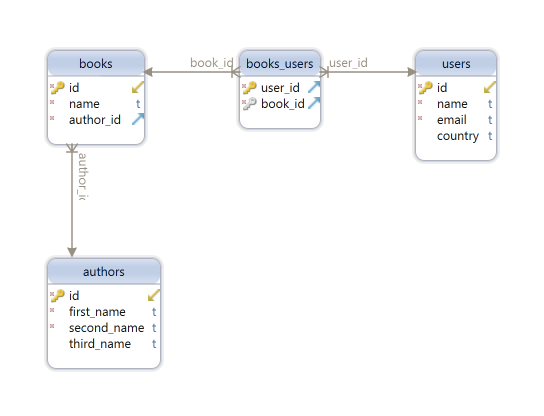

# ASTON Homework 2
## Задачи:
1)	Сделать REST сервис с использованием JDBC и Servlet
2)	Функционал любой на выбор, минимум CRUD сервис с несколькими видами entity
3)	Запрещено использовать Spring, Hibernate, Lombok
4)	Можно использовать Hikari CP, Mapstruсt
5)	Параметры подключения к БД должны быть вынесены в файл
6)	Должны быть реализованы связи ManyToOne(OneToMany), ManyToMany
7)	Связи должны быть отражены в коде(должны быть соответствующие коллекции внутри энтити)
8)	Сервлет должен возвращать DTO, не возвращаем Entity, принимать также DTO
9)	Должна быть правильная архитектура
10)	Должен быть сервисный слой
11)	Должны соблюдаться принципы ООП, Solid
12)	Должны быть unit тесты, использовать Mockito и Junit, для проверки работы репозитория(DAO) с БД использовать testcontainers
13)	Покрытие тестами должно быть больше 80%
14)	Должны быть протестированы все слои приложения
15)	Слой сервлетов, сервисный слой тестировать с помощью Mockito

## Реализация:

### Связи сущностей

Автор книги 1:m Книга

Пользователь(читатель) m:m Книга

### API
1) UserServlet - [com.zhmenko.user.servlet.UserServlet](./src/main/java/com/zhmenko/user/servlet/UserServlet.java)

Тесты:

[Слой Сервлетов](./src/test/java/com/zhmenko/user/servlet/UserServletTest.java)

[Сервисный слой](./src/test/java/com/zhmenko/user/service/UserServiceTest.java)

[Слой данных](./src/test/java/com/zhmenko/user/data/dao/UserDaoTest.java)

Описание запросов:

- GET - получение данных о пользователе по id.

  Пример: http://localhost:8080/servlet_rest_war/users/1 - получение данных о пользователе с id 1.

- POST - создание пользователя 
  
  Пример: http://localhost:8080/servlet_rest_war/users/ - создание пользователя
  
  Пример передаваемых данных:
  ```
  {
  "name": "username",
  "email": "mail@mail.ru",
  "country": "RUS"
  }
  ```
- PUT - изменение данных о пользователе

  Пример: http://localhost:8080/servlet_rest_war/users/1 - изменение данных о пользователе с id 1.

  Пример передаваемых данных:
  ```
  {
  "id": 1,
  "name": "username",
  "email": "mail@mail.ru",
  "country": "RUS"
  }
  ```
- GET - Удаление пользователя по id.
  Пример: http://localhost:8080/servlet_rest_war/users/1 - удаления пользователя с id 1.
2) BookServlet [com.zhmenko.book.servlet.BookServlet](./src/main/java/com/zhmenko/book/servlet/BookServlet.java)

Тесты:

[Слой Сервлетов](./src/test/java/com/zhmenko/book/servlet/BookServletTest.java)

[Сервисный слой](./src/test/java/com/zhmenko/book/service/BookServiceTest.java)

[Слой данных](./src/test/java/com/zhmenko/book/data/dao/BookDaoTest.java)

Описание запросов:

- GET - получение данных о книге по id.
  Пример: http://localhost:8080/servlet_rest_war/books/1 - получение данных о книге с id 1.
- POST - создание книги

  Пример: http://localhost:8080/servlet_rest_war/books/ - создание книги

  Пример передаваемых данных:
  ```
  {
  "name": "book name",
  "author_id": 1
  }
  ```
- PUT - изменение данных о книге

  Пример: http://localhost:8080/servlet_rest_war/books/1 - изменение данных о книге с id 1.

  Пример передаваемых данных:
  ```
  {
    "id": 1,
    "name": "book name 2",
    "author_id": 2
  }
  ```
- GET - Удаление книги по id.
  Пример: http://localhost:8080/servlet_rest_war/books/1 - удаления книги с id 1.
3) AuthorServlet [com.zhmenko.author.servlet.AuthorServlet](./src/main/java/com/zhmenko/author/servlet/AuthorServlet.java)

Тесты:

[Слой Сервлетов](./src/test/java/com/zhmenko/author/servlet/AuthorServletTest.java)

[Сервисный слой](./src/test/java/com/zhmenko/author/service/AuthorServiceTest.java)

[Слой данных](./src/test/java/com/zhmenko/author/data/dao/AuthorDaoTest.java)

Описание запросов:

- GET - получение данных об авторе по id.

  Пример: http://localhost:8080/servlet_rest_war/authors/1 - получение данных об авторе с id 1.

- POST - создание автора

  Пример: http://localhost:8080/servlet_rest_war/authors/ - создание автора

  Пример передаваемых данных:
  ```
  {
  "first_name": "hello",
  "second_name": "my",
  "third_name": "world"
  }
  ```
- PUT - изменение данных об авторе

  Пример: http://localhost:8080/servlet_rest_war/authors/1 - изменение данных об авторе с id 1.

  Пример передаваемых данных:
  ```
  {
  "id": 1,
  "first_name": "new first_name",
  "second_name": "new second_name",
  "third_name": "new third_name"
  }
  ```
- GET - Удаление книги по id.

  Пример: http://localhost:8080/servlet_rest_war/authors/1 - удаления автора с id 1.

4) UserBookServlet [com.zhmenko.user_book.servlet.UserBookServlet](./src/main/java/com/zhmenko/user_book/servlet/UserBookServlet.java) 

Тесты:

[Слой Сервлетов](./src/test/java/com/zhmenko/user_book/servlet/UserBookServletTest.java)

[Сервисный слой](./src/test/java/com/zhmenko/user_book/service/UserBookServiceTest.java)

[Слой данных](./src/test/java/com/zhmenko/user_book/data/dao/UserBookDaoTest.java)

Описание запросов:

- GET - НЕДОСТУПНО.

- POST - добавление книг пользователю с заданным id

  Пример: http://localhost:8080/servlet_rest_war/usersbooks/ - Добавление книг с id 1, 2, 3 пользователю с id 1

  Пример передаваемых данных:
  ```
  {
  "user_id": 1,
  "books_id": [1,2,3]
  }
  ```
- PUT - НЕДОСТУПНО.

- DELETE - удаление книг у пользователя с заданным id

  Пример: http://localhost:8080/servlet_rest_war/usersbooks/ - удаления книг с id 1, 2, 3 у автора с id 1.
  ```
  {
  "user_id": 1,
  "books_id": [1,2,3]
  }
  ```
## Инструменты
- Java 17
- Servlet api
- Guice - внедрение зависимостей
- PostgreSQL - СУБД
- HikariCP - connection pool
- Flyway - версионная миграция бд
- GSON - работа с json строками
- Mapstruct (DTO <-> Entity преобразование, кодогенерация)
- Maven (сборка)

Тесты
1
- JUnit 5 (тестирование)
- Mockito (слой сервлетов и сервисный слой)
- TestContainers (слой данный)
- Json assert (сравнение json строк) 
- JaCoCo (проверка покрытия тестами)
## Сборка (для тестирования слоя данных необходим установленный Docker)
mvn clean package
## Запуск
Полученный после этапа сборки файл .war задеплоить на tomcat 
## Работа с API
[Шаблоны запросов Postman](Rest%20aston.postman_collection.json)
## Дополнительно
[SQL файл схемы базы данных](src/main/resources/aston_db_script.sql)