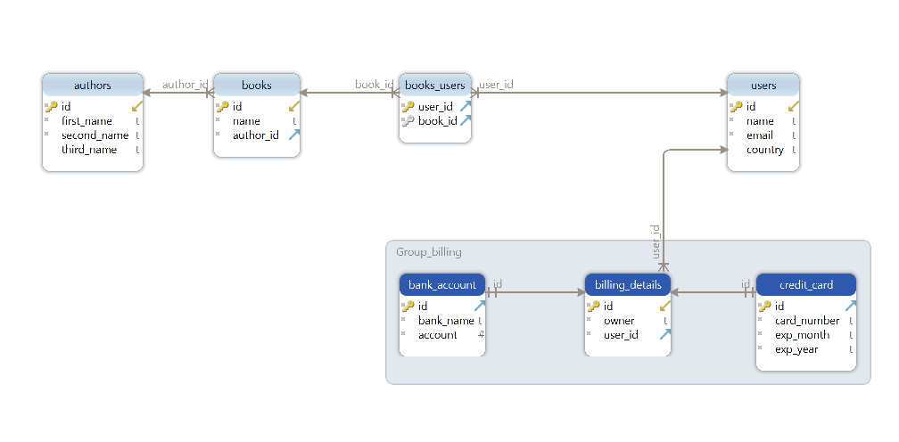

# ASTON Homework 3
## Задачи:
1) Переписать весь проект из предыдущего
практического задания с использованием Hibernate
(без Spring!!!!!!)
2) Заимплементить связь ManyToMany в Hibernate (а
такая связь уже должна у вас быть в СУБД, если
требования предыдущей практической задачи были
выполнены. Если ее не оказалось - то добавьте.
3) Настроить каскадные связи между сущностями с
помощью Hibernate.
4) Расширить ваш существующий домен приложения.
Теперь у вас будет 1 базовый абстрактный класс


4.1) От этого класса вы должны создать 3 подкласса -
наследника

4.2) Придумать и добавить каждому из подклассов
уникальные поля, не обозначенные в суперклассе 

4.3) Заимплементить иерархии наследования в БД -
каждая команда выбирает свою стратегию
наследования (SINGLE_TABLE, JOINED,
TABLE_PER_CLASS)

4.4) Сделать в коде полиморфные запросы ко всем
классам-наследникам.

4.5) Убедиться, что идентификаторы пользователя
идентичны среди всех возможных его типов
(использовать общий sequence в Postgres)

5) Воспроизвести в вашем коде проблему N+1 запроса в
Hibernate
6) Решить в коде проблему N+1 запроса
7) Воспроизвести LazyInitializationException
8) В одну из таблиц вашей базы, где есть числовое поле,   NOT IMPLEMENTED

добавьте 20 миллионов рандомно сгенерированных
строк:     

8.1) Попытайтесь в DAO уровне вашего приложения
сделать метод, где через Hibernate вытаскивается                
из таблицы все строки, где значение числового
поля > 2000

8.2) Попытайтесь оптимизировать этот метод с
помощью индексов.

8.3) После этого повторно выполните метод и
сравните время выполнения запроса

8.4) Подключить для этого метода кэш 2 уровня ( с
помощью хибера)

8.5) Кэш запросов должен работать и
сбрасываться каждые 30 секунд

8.6) Убедитесь, что кэш работает

## Реализация:

### Связи сущностей

Автор книги 1:m Книга

Пользователь(читатель) m:m Книга

Пользователь(читатель) 1:m Billing

### API
1) UserServlet - [com.zhmenko.user.servlet.UserServlet](./src/main/java/com/zhmenko/user/servlet/UserServlet.java)

Тесты:

[Слой Сервлетов](./src/test/java/com/zhmenko/user/servlet/UserServletTest.java)

[Сервисный слой](./src/test/java/com/zhmenko/user/service/UserServiceTest.java)

[Слой данных](./src/test/java/com/zhmenko/user/data/dao/UserDaoTest.java)

Описание запросов:

- GET - получение данных о пользователе по id.

  Пример: http://localhost:8080/servlet_rest_war/users/1 - получение данных о пользователе с id 1.

- POST - создание пользователя 
  
  Пример: http://localhost:8080/servlet_rest_war/users/ - создание пользователя
  
  Пример передаваемых данных:
  ```
  {
  "name": "username",
  "email": "mail@mail.ru",
  "country": "RUS"
  }
  ```
- PUT - изменение данных о пользователе

  Пример: http://localhost:8080/servlet_rest_war/users/1 - изменение данных о пользователе с id 1.

  Пример передаваемых данных:
  ```
  {
  "id": 1,
  "name": "username",
  "email": "mail@mail.ru",
  "country": "RUS"
  }
  ```
- GET - Удаление пользователя по id.
  Пример: http://localhost:8080/servlet_rest_war/users/1 - удаления пользователя с id 1.
2) BookServlet [com.zhmenko.book.servlet.BookServlet](./src/main/java/com/zhmenko/book/servlet/BookServlet.java)

Тесты:

[Слой Сервлетов](./src/test/java/com/zhmenko/book/servlet/BookServletTest.java)

[Сервисный слой](./src/test/java/com/zhmenko/book/service/BookServiceTest.java)

[Слой данных](./src/test/java/com/zhmenko/book/data/dao/BookDaoTest.java)

Описание запросов:

- GET - получение данных о книге по id.
  Пример: http://localhost:8080/servlet_rest_war/books/1 - получение данных о книге с id 1.
- POST - создание книги

  Пример: http://localhost:8080/servlet_rest_war/books/ - создание книги

  Пример передаваемых данных:
  ```
  {
  "name": "book name",
  "author_id": 1
  }
  ```
- PUT - изменение данных о книге

  Пример: http://localhost:8080/servlet_rest_war/books/1 - изменение данных о книге с id 1.

  Пример передаваемых данных:
  ```
  {
    "id": 1,
    "name": "book name 2",
    "author_id": 2
  }
  ```
- GET - Удаление книги по id.
  Пример: http://localhost:8080/servlet_rest_war/books/1 - удаления книги с id 1.
3) AuthorServlet [com.zhmenko.author.servlet.AuthorServlet](./src/main/java/com/zhmenko/author/servlet/AuthorServlet.java)

Тесты:

[Слой Сервлетов](./src/test/java/com/zhmenko/author/servlet/AuthorServletTest.java)

[Сервисный слой](./src/test/java/com/zhmenko/author/service/AuthorServiceTest.java)

[Слой данных](./src/test/java/com/zhmenko/author/data/dao/AuthorDaoTest.java)

Описание запросов:

- GET - получение данных об авторе по id.

  Пример: http://localhost:8080/servlet_rest_war/authors/1 - получение данных об авторе с id 1.

- POST - создание автора

  Пример: http://localhost:8080/servlet_rest_war/authors/ - создание автора

  Пример передаваемых данных:
  ```
  {
  "first_name": "hello",
  "second_name": "my",
  "third_name": "world"
  }
  ```
- PUT - изменение данных об авторе

  Пример: http://localhost:8080/servlet_rest_war/authors/1 - изменение данных об авторе с id 1.

  Пример передаваемых данных:
  ```
  {
  "id": 1,
  "first_name": "new first_name",
  "second_name": "new second_name",
  "third_name": "new third_name"
  }
  ```
- GET - Удаление книги по id.

  Пример: http://localhost:8080/servlet_rest_war/authors/1 - удаления автора с id 1.

4) UserBookServlet [com.zhmenko.user.servlet.UserBookServlet](./src/main/java/com/zhmenko/user/servlet/UserBookServlet.java) 

Описание запросов:

- GET - НЕДОСТУПНО.

- POST - добавление книг пользователю с заданным id

  Пример: http://localhost:8080/servlet_rest_war/users/books/ - Добавление книги с id 1 пользователю с id 1

  Пример передаваемых данных:
  ```
  {
  "user_id": 1,
  "book_id": 1
  }
  ```
- PUT - НЕДОСТУПНО.

- DELETE - удаление книги у пользователя с заданным id

  Пример: http://localhost:8080/servlet_rest_war/usersbooks/ - удаления книг с id 1 у пользователя с id 1.
  ```
  {
  "user_id": 1,
  "book_id": 1
  }
  ```
5) UserBillingDetailsServlet [com.zhmenko.user.servlet.UserBillingDetailsServlet](./src/main/java/com/zhmenko/user/servlet/UserBillingDetailsServlet.java)

Описание запросов:

- GET - НЕДОСТУПНО.

- POST - добавление способа оплаты пользователю с заданным id

  Пример: http://localhost:8080/servlet_rest_war/users/billings/ - Добавление способа оплаты пользователю с id 2

  Пример передаваемых данных:
  Кредитная карта:
  ```
  {
  "billing_type": "credit_card",
  "user_id": 2,
  "owner": "Me"
  "card_number": "1231251266",
  "exp_month": "01",
  "exp_year": "2025",
  }
  ```
  Банковский аккаунт:
  ```
  {
  "billing_type": "bank_account",
  "user_id": 2,
  "owner": "Me",
  "account": 12324125,
  "bank_name": "VTB"
  }
  ```
- PUT - НЕДОСТУПНО.

- DELETE - удаление способа оплаты у пользователя с заданным id

  Пример: http://localhost:8080/servlet_rest_war/billings/ - удаления способа оплаты с id 1 у пользователя с id 2.
  ```
  {
  "user_id": 2,
  "billing_details_id": 1
  }
  ```
## Инструменты
- Java 17
- Servlet api
- Guice - внедрение зависимостей
- PostgreSQL - СУБД
- HikariCP - connection pool
- Hibernate - ORM
- Infinispan - jpa cache
- Hibernate bean validation
- Flyway - версионная миграция бд
- GSON - работа с json строками
- Mapstruct (DTO <-> Entity преобразование, кодогенерация)
- Maven (сборка)

Тесты
- JUnit 5 (тестирование)
- Mockito (слой сервлетов и сервисный слой)
- TestContainers (слой данный)
- Json assert (сравнение json строк) 
- JaCoCo (проверка покрытия тестами)
## Сборка (для тестирования слоя данных необходим установленный Docker)
mvn clean package
## Запуск
Полученный после этапа сборки файл .war задеплоить на tomcat 
## Работа с API
[Шаблоны запросов Postman](Rest%20aston.postman_collection.json)
## Дополнительно
[SQL файл схемы базы данных](src/main/resources/aston_db_script.sql)